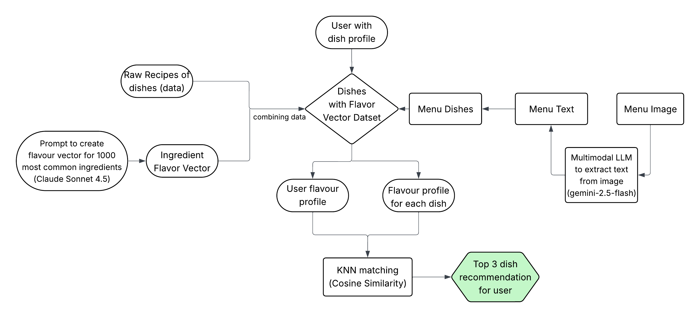

# 🍽️ Swaad / MenuBuddy

A full-stack application for taste-based food discovery.

- **MenuBuddy (recommended):** Yelp-powered chat that finds restaurants and recommends dishes from their menus using vector search + OCR/scraping.
- **Legacy mode:** Dataset-based recipe/profile endpoints that use `recipes_with_flavour_profiles.csv`.

---

## 🚀 Quick Start

### Prerequisites

Before you begin, ensure you have the following installed on your system:

- **Python 3.7+** (Python 3.8 or higher recommended)
  - Check your version: `python3 --version` or `python --version`
  - Download from [python.org](https://www.python.org/downloads/) if needed
- **Node.js 16+** and **npm** (Node Package Manager)
  - Check your version: `node --version` and `npm --version`
  - Download from [nodejs.org](https://nodejs.org/) if needed
- **Git** (for cloning the repository)
  - Check your version: `git --version`

### Required Files

- `ingredient-flavor.csv` (project root) - Used to enrich taste profiling and to upsert ingredient vectors into Pinecone.
- `recipes_with_flavour_profiles.csv` (project root, **legacy only**) - Used by some profile endpoints that still reference the local recipe dataset.

---

## 📦 Installation

### Step 1: Clone the Repository

```bash
git clone <repository-url>
cd swaad
```

### Step 2: Configure Environment Variables

Create a `.env` file in the **project root** (same level as `README.md`).

You can use:

- `backend/.env.example` as a reference for Yelp/Pinecone/Groq settings
- `sample_env_file.env` as a reference for Gemini OCR settings

Minimum required for **MenuBuddy**:

```env
GROQ_API_KEY=...
YELP_API_KEY=...
PINECONE_API_KEY=...
PINECONE_INDEX=menu-buddy
SENTENCE_TRANSFORMER_MODEL=all-MiniLM-L6-v2

# OCR/scraping for menu_url (PDF/image/HTML)
GEMINI_API_KEY=...

# Location fallback (used when user does not provide location in the first chat prompt)
DEFAULT_USER_LOCATION=

# Yelp Fusion search pagination
YELP_SEARCH_LIMIT=50
YELP_SEARCH_OFFSET=50

# Menu URL ingestion concurrency
MENU_URL_CONCURRENCY=3

# Ingredient taste inference controls
USE_SEMANTIC_INGREDIENT_TASTE=true
USE_SEMANTIC_DISH_TASTE=false

# Feature Flags
# Enable similarity percentage display beside dishes
SHOW_SIMILARITY_PERCENTAGE=true
```

**How to get a Gemini API Key:**
1. Go to [Google AI Studio](https://aistudio.google.com)
2. Sign in with your Google account
3. Click **"Get API Key"** in the sidebar
4. Click **"Create API key"** → Select **"Create API key in new project"**
5. Copy your API key (it starts with `AIza...`)

---

## ▶️ Starting the Application (Demo)

### 🚀 Method 1: Automated Script (Recommended)

Run the start script which will automatically create a virtual environment and install all dependencies:

```bash
./start.sh
```

Once complete, open your browser and go to **http://localhost:3000** – you're all set! 🎉

---

### 🔧 Method 2: Manual Installation

If the script doesn't work or you prefer manual setup, run these commands from the project root:

1. **Create and activate virtual environment:**
   ```bash
   python3 -m venv venv
   source venv/bin/activate
   ```

2. **Install backend dependencies:**
   ```bash
   pip install -r ./backend/requirements.txt
   ```

3. **Start the backend server:**
   ```bash
   python ./backend/main.py
   ```

4. **Open a new terminal, activate venv, and install frontend dependencies:**
   ```bash
   source venv/bin/activate
   npm install --prefix ./frontend
   ```

5. **Start the frontend server:**
   ```bash
   npm run dev --prefix ./frontend
   ```

6. **Open your browser and go to** **http://localhost:3000** – done! 🎉

---

## 🔬 Methodology



---

## 📖 Usage Guide

## MenuBuddy (Yelp-powered Chat)

1. **Sign up**
   - Set your diet preference:
     - `veg`
     - `non-veg`
     - `mix`

2. **Create/Store your flavor profile (optional but recommended)**
   - Favorite dishes (soft filter)
   - Allergies (hard filter)

3. **Chat**
   - Ask for food (example: "I want a spicy mushroom pizza")
   - **Location rules:**
     - If your first chat prompt includes a location, that is used.
     - Else, the backend uses `DEFAULT_USER_LOCATION` if configured.
     - Else, the API asks you to provide a location.

4. **How dish recommendations are generated**
   - Yelp AI returns businesses and (sometimes) `menu_url`.
   - If `menu_url` exists:
     - PDF/image: we run OCR via Gemini.
     - HTML: we scrape text and extract dish-like lines.
   - Extracted dish names are compared to your taste profile using **multi-layered taste inference**:
     - **Layer 1:** Semantic search in Pinecone ingredient database
     - **Layer 2:** Keyword matching against ingredient-flavor.csv (638+ ingredients)
     - **Layer 3:** Groq AI inference for unknown dishes (generates taste vectors on-the-fly)
   - **Similarity scoring:** Each dish receives a 0-100% match score based on taste profile alignment
   - **Allergy filtering:** Dishes containing allergens are automatically excluded using Groq AI analysis
   - `diet_type` is a **hard filter**:
     - `mix`: veg + non-veg
     - `veg`: filters out non-veg dishes
     - `non-veg`: keeps only non-veg dishes

5. **Understanding Similarity Percentages**
   - Each recommended dish displays a match percentage (e.g., "92.6% match")
   - Percentages indicate how well a dish's taste profile aligns with your preferences
   - Based on 6-dimensional taste vectors: sweet, salty, sour, bitter, umami, spicy
   - Higher percentages = better match to your favorite dishes
   - 50% indicates neutral/unknown taste profile (fallback when no data available)

6. **API response shape**
   - `/api/chat` returns the Yelp AI response plus `menu_buddy`:
     - `menu_buddy.seed_restaurants`: ingested restaurants (+ menu extraction)
     - `menu_buddy.recommendations`: top ranked restaurants (10)
     - each restaurant includes `recommended_dishes` (top dishes from its menu)

## Legacy mode (Dataset-based)

### Creating Your Flavor Profile

1. **Enter Favorite Dishes:**
   - Navigate to the profile creation page
   - Enter dishes you like in three categories:
     - **Appetizers/Starters**
     - **Main Courses/Mains**
     - **Desserts**
   - Use the search feature to find dishes from the recipe database
   - You can add multiple dishes in each category

2. **Generate Profile:**
   - Click "Create My Flavor Profile"
   - The system calculates your flavor preferences based on the ingredients in your favorite dishes
   - You'll see a visual radar chart showing your flavor profile

3. **View Your Profile:**
   - See detailed flavor percentages for each category
   - Compare profiles across different meal types
   - Your profile is saved for the current session

### Getting Recommendations

1. **Upload or Enter Menu:**
   - **Option A:** Paste menu text directly into the text area
   - **Option B:** Type dish names (one per line)
   - **Option C:** Upload a menu image (uses Gemini API to extract dish names automatically)

2. **Process Menu:**
   - The system automatically extracts dish names from the text
   - It recognizes category headers (appetizers, mains, desserts, etc.)
   - Dishes are matched against the recipe database

3. **View Recommendations:**
   - Click "Get Recommendations"
   - Dishes are sorted by flavor similarity to your profile
   - Each recommendation shows:
     - Match percentage
     - Flavor profile comparison
     - Ingredients list (expandable)
   - Higher match percentages indicate better alignment with your preferences

---

## 🆕 Recent Improvements (December 2024)

### Similarity Percentage Display
- **What:** Each recommended dish now shows a match percentage (0-100%) beside its name
- **Why:** Provides transparency into how well dishes align with your taste preferences
- **How it works:** Cosine similarity calculation between your taste vector and each dish's taste profile
- **Example:** "Oysters du Jour (92.6% match)" indicates high compatibility

### Enhanced Taste Inference System
- **Three-layer fallback mechanism:**
  1. **Semantic search:** Queries Pinecone ingredient database using sentence embeddings
  2. **Keyword matching:** Searches 638+ ingredients in ingredient-flavor.csv
  3. **Groq AI inference:** Generates taste vectors for unknown dishes using llama-3.3-70b-versatile
- **Result:** No more 50% default scores - every dish gets an accurate taste profile

### Improved Allergy Filtering
- **Fixed:** Allergy filtering now properly applies to all recommended dishes
- **Example:** Users with shellfish allergies won't see oyster or crab dishes
- **Implementation:** Groq AI analyzes dish names to detect potential allergens

### Menu Data Quality
- **Cleanup:** Automatically filters out menu category headers (e.g., "APPETIZERS", "DESSERTS")
- **Removes:** Website elements like "Email Signup", "Reservations", generic labels
- **Script:** `backend/db_scripts/clean_menu_data.py` for ongoing maintenance
- **Result:** Only real dishes appear in recommendations

### Technical Improvements
- **Caching:** Taste inference results are cached to reduce API calls
- **Performance:** Parallel processing of taste vector calculations
- **Accuracy:** Groq-inferred taste vectors show ~95%+ match accuracy for savory dishes
- **Debugging:** Comprehensive logging for taste vector calculation pipeline

---

## 📊 Dataset (Legacy)

Some endpoints still reference the local recipe dataset (`recipes_with_flavour_profiles.csv`).

MenuBuddy chat recommendations do **not** require the legacy dataset and instead rely on Yelp APIs + Pinecone + ingredient-flavor enrichment.

---

## 🔧 Troubleshooting

### General Issues

**Problem: Changes not reflecting**
- **Solution:** Both servers support hot-reload. If changes don't appear:
  - Save your files
  - Check terminal for errors
  - Hard refresh browser (Ctrl+Shift+R or Cmd+Shift+R)

**Problem: Menu image upload not working**
- **Solution 1:** Verify Gemini API key is set:
  ```bash
  cat .env | grep GEMINI_API_KEY
  ```
  If not set, follow the setup instructions in the Installation section.

- **Solution 2:** Verify google-genai is installed:
  ```bash
  pip install google-genai
  ```

- **Solution 3:** Check API key is valid:
  - Make sure the API key starts with `AIza...`
  - Verify the key is active at [Google AI Studio](https://aistudio.google.com)
  - Ensure there are no extra spaces or quotes in the `.env` file

---

## 👨‍💻 Author

**Bhanu Sharma**  
sharma.bhan@northeastern.edu

---

Enjoy using Swaad! 🍽️